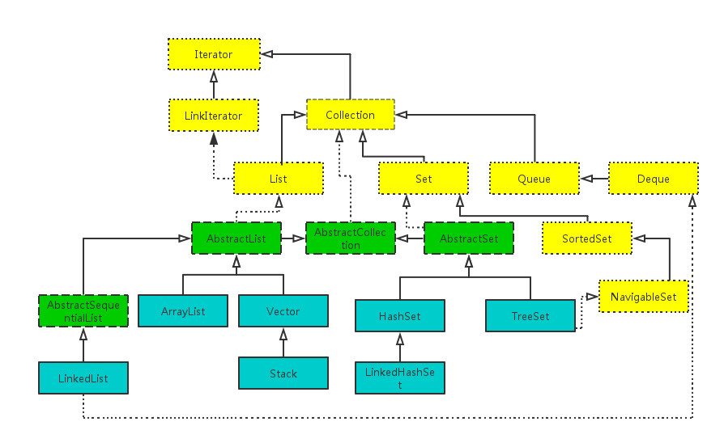

##集合框架

* 

###集合的由来及集合继承体系图
* 集合的由来
	* 数组长度是固定,当添加的元素超过了数组的长度时需要对数组重新定义,太麻烦,java内部给我们提供了集合类,能存储任意对象,长度是可以改变的,随着元素的增加而增加,随着元素的减少而减少 
* 数组和集合的区别
	* 区别1 : 
		* 数组既可以存储基本数据类型,又可以存储引用数据类型,基本数据类型存储的是值,引用数据类型存储的是地址值
		* 集合只能存储引用数据类型(对象)集合中也可以存储基本数据类型,但是在**存储的时候会自动装箱变成对象**
	* 区别2:
		* 数组长度是固定，初始化后就不能修改。
		* 集合的长度的是可变的,可以根据元素的增加而增长（本质上还是数组实现的，变长的时候创建新数组丢弃旧数组）
* 什么时候用数组，什么时候用集合
		* 1,如果元素个数是固定的推荐用数组
		* 2,如果元素个数不是固定的推荐用集合
* 集合继承体系图
	
	* collection[接口] 下分为List和Set
	* list：代表列表，代表有序！里面的元素按照存入的次序排列，数据是可以重复的。
		* LinkedList是链表
		* ArrayList和Vector是数组 
	* set：代表集合，代表无序！
		* HashSet是hash算法
		* TreeSet是二叉树

###Collection集合的基本功能测试
* A:案例演示	
* 
		基本功能演示
		
		boolean add(E e)
		boolean remove(Object o)
		void clear()
		boolean contains(Object o)
		boolean isEmpty()
		int size()

* B:注意:
*  
		collectionXxx.java使用了未经检查或不安全的操作.
		注意:要了解详细信息,请使用 -Xlint:unchecked重新编译.
		java编译器认为该程序存在安全隐患
		温馨提示:这不是编译失败,所以先不用理会,等学了泛型你就知道了
	  
###15.04_集合框架(集合的遍历之集合转数组遍历)
* A:集合的遍历
	* 其实就是依次获取集合中的每一个元素。
* B:案例演示
	* 把集合转成数组，可以实现集合的遍历
	* toArray()
	*
		
			Collection coll = new ArrayList();
			coll.add(new Student("张三",23));		//Object obj = new Student("张三",23);
			coll.add(new Student("李四",24));
			coll.add(new Student("王五",25));
			coll.add(new Student("赵六",26));
			
			Object[] arr = coll.toArray();				//将集合转换成数组
			for (int i = 0; i < arr.length; i++) {
				Student s = (Student)arr[i];			//强转成Student
				System.out.println(s.getName() + "," + s.getAge());
			}

###15.05_集合框架(Collection集合的带All功能测试)
* A:案例演示
* 
		带All的功能演示
		
		boolean addAll(Collection c)
		boolean removeAll(Collection c)
		boolean containsAll(Collection c)
		boolean retainAll(Collection c)

###15.06_集合框架(集合的遍历之迭代器遍历)
* A:迭代器概述
	* 集合是用来存储元素,存储的元素需要查看,那么就需要迭代(遍历) 
* B:案例演示
	* 迭代器的使用
		
			Collection c = new ArrayList();
			c.add("a");
			c.add("b");
			c.add("c");
			c.add("d");
			
			Iterator it = c.iterator();						//获取迭代器的引用
			while(it.hasNext()) {							//集合中的迭代方法(遍历)
				System.out.println(it.next());
			}
	
			
###15.07_集合框架(Collection存储自定义对象并遍历)
* A:案例演示
	* Collection存储自定义对象并用迭代器遍历
	* 
			Collection c = new ArrayList();
			
			c.add(new Student("张三",23));
			c.add(new Student("李四",24));
			c.add(new Student("王五",25));
			c.add(new Student("赵六",26));
			c.add(new Student("赵六",26));
			
			for(Iterator it = c.iterator();it.hasNext();) {
				Student s = (Student)it.next();						//向下转型
				System.out.println(s.getName() + "," + s.getAge());	//获取对象中的姓名和年龄
			}
			System.out.println("------------------------------");
			Iterator it = c.iterator();								//获取迭代器
			while(it.hasNext()) {									//判断集合中是否有元素
				//System.out.println(((Student)(it.next())).getName() + "," + ((Student)(it.next())).getAge());
				Student s = (Student)it.next();						//向下转型
				System.out.println(s.getName() + "," + s.getAge());	//获取对象中的姓名和年龄
			}
		

###15.08_集合框架(迭代器的原理及源码解析)(了解)
* A:迭代器原理
	* 迭代器原理:迭代器是对集合进行遍历,而每一个集合内部的存储结构都是不同的,所以每一个集合存和取都是不一样,那么就需要在每一个类中定义hasNext()和next()方法,这样做是可以的,但是会让整个集合体系过于臃肿,迭代器是将这样的方法向上抽取出接口,然后在每个类的内部,定义自己迭代方式,这样做的好处有二,第一规定了整个集合体系的遍历方式都是hasNext()和next()方法,第二,代码有底层内部实现,使用者不用管怎么实现的,会用即可 
* B:迭代器源码解析
	* 1,在eclipse中ctrl + shift + t找到ArrayList类
	* 2,ctrl+o查找iterator()方法
	* 3,查看返回值类型是new Itr(),说明Itr这个类实现Iterator接口
	* 4,查找Itr这个内部类,发现重写了Iterator中的所有抽象方法 

###15.09_集合框架(List集合的特有功能概述和测试)
* A:List集合的特有功能概述
	* void add(int index,E element)
	* E remove(int index)
	* E get(int index)
	* E set(int index,E element)

###15.10_集合框架(List集合存储学生对象并遍历)
* A:案例演示
	* 通过size()和get()方法结合使用遍历。

			List list = new ArrayList();
			list.add(new Student("张三", 18));
			list.add(new Student("李四", 18));
			list.add(new Student("王五", 18));
			list.add(new Student("赵六", 18));
			
			for(int i = 0; i < list.size(); i++) {
				Student s = (Student)list.get(i);
				System.out.println(s.getName() + "," + s.getAge());
			}

###15.11_集合框架(并发修改异常产生的原因及解决方案)
* A:案例演示
	* 需求：我有一个集合，请问，我想判断里面有没有"world"这个元素，如果有，我就添加一个"javaee"元素，请写代码实现。

			List list = new ArrayList();
			list.add("a");
			list.add("b");
			list.add("world");
			list.add("d");
			list.add("e");
			
			/*Iterator it = list.iterator();
			while(it.hasNext()) {
				String str = (String)it.next();
				if(str.equals("world")) {
					list.add("javaee");			//这里会抛出ConcurrentModificationException并发修改异常
				}
			}*/
			
			
* B:ConcurrentModificationException出现
	* 迭代器遍历，集合修改集合
* C:解决方案
	* a:迭代器迭代元素，迭代器修改元素(ListIterator的特有功能add)
	* b:集合遍历元素，集合修改元素

			ListIterator lit = list.listIterator();		//如果想在遍历的过程中添加元素,可以用ListIterator中的add方法
			while(lit.hasNext()) {
				String str = (String)lit.next();
				if(str.equals("world")) {
					lit.add("javaee");	
					//list.add("javaee");
				}
			}

###15.12_集合框架(ListIterator)(了解)
* boolean hasNext()是否有下一个
* boolean hasPrevious()是否有前一个
* Object next()返回下一个元素
* Object previous();返回上一个元素

###15.13_集合框架(Vector的特有功能)
* A:Vector类概述
* B:Vector类特有功能
	* public void addElement(E obj)
	* public E elementAt(int index)
	* public Enumeration elements()
* C:案例演示	
	* Vector的迭代

			Vector v = new Vector();				//创建集合对象,List的子类
			v.addElement("a");
			v.addElement("b");
			v.addElement("c");
			v.addElement("d");
			
			//Vector迭代
			Enumeration en = v.elements();			//获取枚举
			while(en.hasMoreElements()) {			//判断集合中是否有元素
				System.out.println(en.nextElement());//获取集合中的元素
			}

###15.14_集合框架(数据结构之数组和链表)
* A:数组
	* 查询快修改也快
	* 增删慢
* B:链表
	* 查询慢,修改也慢
	* 增删快

###15.15_集合框架(List的三个子类的特点)
* A:List的三个子类的特点
* 
		ArrayList:
			底层数据结构是数组，查询快，增删慢。
			线程不安全，效率高。
		Vector:
			底层数据结构是数组，查询快，增删慢。
			线程安全，效率低。
		Vector相对ArrayList查询慢(线程安全的)
		Vector相对LinkedList增删慢(数组结构)
		LinkedList:
			底层数据结构是链表，查询慢，增删快。
			线程不安全，效率高。

		Vector和ArrayList的区别
			Vector是线程安全的,效率低
			ArrayList是线程不安全的,效率高
		共同点:都是数组实现的
		ArrayList和LinkedList的区别
			ArrayList底层是数组结果,查询和修改快
			LinkedList底层是链表结构的,增和删比较快,查询和修改比较慢
		共同点:都是线程不安全的
* B:List有三个儿子，我们到底使用谁呢?
		查询多用ArrayList
		增删多用LinkedList
		如果都多ArrayList
###15.16_day15总结
把今天的知识点总结一遍。